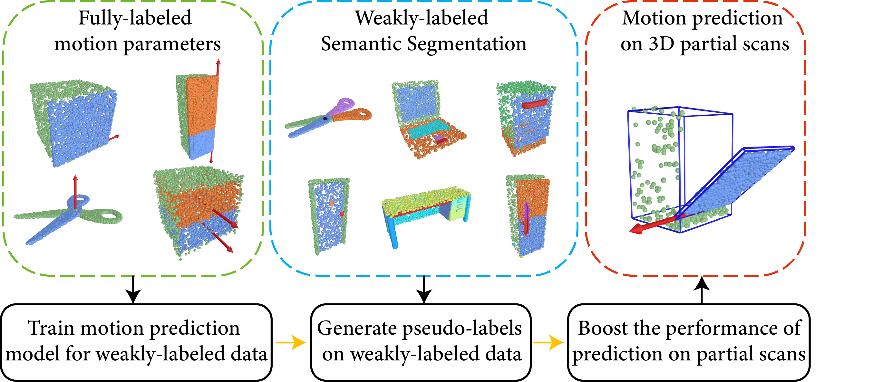

# Semi-Weakly Supervised Object Kinematic Motion Prediction (2023 CVPR)

<!-- ## Introduction <a name="introduction"></a> -->



## Introduction

In this paper, we tackle the task of object kinematic motion prediction problem in a semi-weakly supervised manner. Our key observations are two-fold. First, although 3D dataset with fully annotated motion labels is limited, there are existing datasets and methods for object
part semantic segmentation at large scale. Second, semantic part segmentation and mobile part segmentation is not always consistent but it is possible to detect the mobile parts from the underlying 3D structure. Towards this end, we propose a graph neural network to learn the map between hierarchical part-level segmentation and mobile parts parameters, which are further refined based on geometric alignment. This network can be first trained on PartNet-Mobility dataset with fully labeled mobility information and then applied on PartNet dataset with fine-grained and hierarchical part-level segmentation. The network predictions yield a large scale of 3D objects with pseudo labeled mobility information and can further be used for weakly-supervised learning with pre-existing segmentation. Our experiments show there are significant performance boosts with the augmented data for previous method designed for kinematic motion prediction on 3D partial scans.

## Dataset

In our experiments, we use the `PartNet-Mobility` dataset and the `PartNet` dataset, please download these two dataset first. Ensure that the directory of `PartNet-Mobility` dataset is as follows:
```
partnet_mobility_root/
    └── dataset/ 
        ├── file_1/ 
                ├── images/
                ├── parts_render/
                ├── parts_render_after_merging/
                ├── point_sample/ 
                ├── textured_objs/
                ├── bounding_box.json
                ├── meta.json
                ├── mobility.urdf
                ├── mobility_v2.json
                ├── result.json
                ├── result_after_merging.json
                ├── semantics.txt
                ├── tree_hier.html
                └── tree_hier_after_merging.html
        ├── file_2
        ├── ... 
        └── file_n 
```
Ensure that the directory of `PartNet` dataset is as follows:
```
partnet_root/
    └── dataset/ 
        ├── Bottle/ 
                └── data_v0/
                    ├── file_1/
                            ├── objs/
                            ├── parts_render/
                            ├── parts_render_after_merging/
                            ├── point_sample/ 
                            ├── meta.json 
                            ├── result.json 
                            ├── result_after_merging.json
                            ├── tree_hier.html
                            └── tree_hier_after_merging.html 
                    ├── file_2/
                    ├── ...
                    └── file_n/
        ├── Chair
        ├── ... 
        └── TrashCan
```


## Installation

We use two virtual environments in our project. The configuration of the first virtual environment are:
- Python 3.8
- cuda 11.2
- Pytorch  1.8.1
- Matlab 9.11.0.1837725 (R2021b)

This virtual environment is used to process the `Partnet-Mobility` dataset and the `PartNet` dataset, and train the models proposed in Section 3.2 and Section 3.3 of our papaer. To install this virtual environment:
```shell
conda create –n motion python=3.8
source activate motion
pip install –r requirements.txt
```
To facilitate the call of matlab functions in python, we need to install the matlab engine for python. Find the matlab installation path `MATLAB_PATH`, and then run the following command. 
```shell
cd MATLAB_PATH/extern/engines/python && python setup.py install
```

The second virtual environment is to verify the effectiveness of the pseudo labels annotated by our method on the `PartNet` dataset. We use [ANCSH](https://github.com/dragonlong/articulated-pose) to verify. Pelease refer to their repository to install the second virtual environment.


## Usage

Before running the code, it is necessary to modify the `config.json` file and set the paths to the data for `PartNet-Mobility` and `PartNet`. The code running steps and descriptions of each folder are as follows:

1. `TableComplete`: Since the objects of the `Table` category in the `PartNet-Mobility` and the `PartNet` dataset miss internal structure, therefore we first complete the internal structure of the table.
2. `NetworkDataExtract`: The code of this folder extracts the network input data on the `PartNet-Mobility` and the `PartNet` dataset.
3. `GnnMotion`: Train the graph neural network proposed in Section 3.2 of our paper.
4. `AxisSelection`: Train the axis selection network proposed in Section 3.3 of our paper.
5. `Predict`: Use the graph neural network and the axis selection network to predict motion parameters on `PartNet` dataset, and generate `mobility_v2.json` file.
6. `Extern`: Convert the annotated `PartNet` data and boost the performance of `ANCSH`.

## License

Our code is released under MIT License. See LICENSE file for details.

## Citation

Please cite the paper in your publications if it helps your research:
```
@article{liu2023semi,
  title={Semi-Weakly Supervised Object Kinematic Motion Prediction},
  author={Liu, Gengxin and Sun, Qian and Huang, Haibin and Ma, Chongyang and Guo, Yulan and Yi, Li and Huang, Hui and Hu, Ruizhen},
  journal={arXiv preprint arXiv:2303.17774},
  year={2023}
}
```

